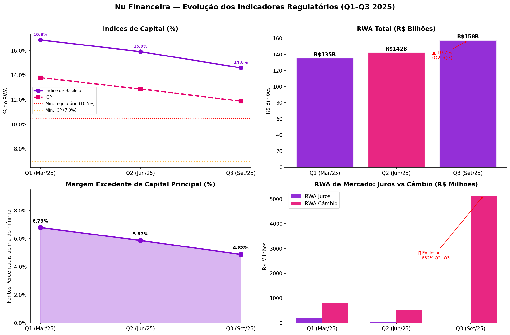
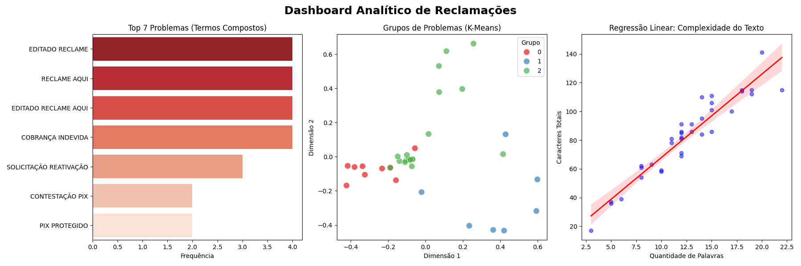
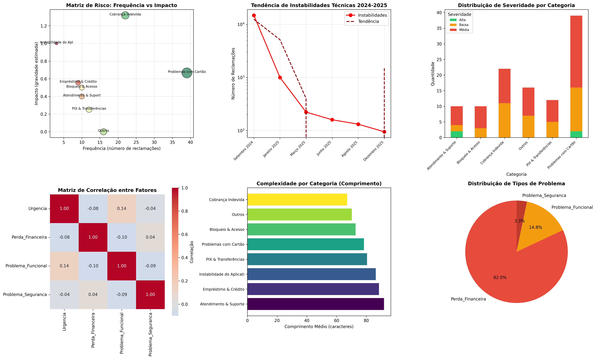

<h2 align="center">🟣 Nubank: Avaliação de Negócios e Análise Preditiva 🟣</h2>


## 📌 Sobre o Projeto

Este repositório documenta uma análise avançada focada no ecossistema do Nubank. O objetivo principal é extrair e identificar problemas e oportunidades de negócio a partir de fontes de dados públicos (dados macroeconômicos, balanços financeiros, sentimento do consumidor, etc.).

Através de análises preditivas e modelagem, o projeto busca avaliar a saúde financeira e o direcionamento estratégico da empresa, culminando em uma apresentação gerencial com foco em tomadas de decisão.

---

## 🗺️ Guia Visual do Repositório


## 📂 Estrutura do Repositório

A arquitetura foi desenhada para garantir a reprodutibilidade da análise, separando dados brutos da experimentação e do código final:

```text
├── data/
│   ├── processed/          # Dados limpos e tratados para modelagem
│   └── raw/                # Dados originais e extrações (imutáveis)
├── notebooks/              # Explorações e testes de hipóteses (.ipynb)
├── reports/                # Apresentação final e dashboards exportados
├── src/                    # Scripts em Python consolidados
│   ├── data_collection.py  # Automações e web scraping (ex: Reclame Aqui)
│   ├── feature_engineering.py
│   ├── modeling.py         # Algoritmos de regressão e forecast
│   └── visualization.py    # Geração de gráficos para a apresentação
├── .gitignore              
├── README.md               
└── requirements.txt        # Bibliotecas necessárias (pandas, scikit-learn, etc.)
```

## 👥 Equipe & Divisão de Responsabilidades  

O pipeline de dados foi estruturado estrategicamente para cobrir **toda a esteira do projeto**, desde a coleta até a geração de insights estratégicos:

### 🔹 Pessoa 1 — Data Engineer  

- Coleta de dados (balanço patrimonial + dados macroeconômicos)  
- Limpeza e tratamento inicial  
- Organização estrutural dos arquivos na pasta `/data`  

### 🔹 Pessoa 2 — Feature Engineer  

- Criação de métricas financeiras  
- Transformações e normalizações  
- Desenvolvimento de variáveis derivadas para enriquecer as análises  

### 🔹 Pessoa 3 — Modelagem  

- Desenvolvimento de modelos preditivos (Regressão e Forecast)  
- Construção de cenários  
- Simulações e análises estatísticas  

### 🔹 Pessoa 4 — Visualização & Business Insights  

- Construção de dashboards  
- Análise estratégica do negócio  
- Elaboração do relatório e apresentação final  

---

## 👤 Integrantes  

- **Thiago Teles**  
- **Paulo Futagawa**  
- **Thaís Nakazone**  
- **Felipe Tavares**  

## 🔄 Fluxo de Trabalho (Code Review)

Nenhum código vai direto para a branch principal.

Fluxo padrão:

- Criar uma **branch** para sua tarefa
- Abrir um **Pull Request (PR)**  
- Passar por **Code Review** de pelo menos um integrante antes do merge  

Esse processo garante organização, qualidade e colaboração no projeto.

## ⚙️ Como Reproduzir o Ambiente

Siga os passos abaixo para configurar o projeto localmente:

### 📥 1. Clone o repositório

```bash
git clone https://github.com/telesvfx/nubank.git
cd nubank
```

## 🐍 2. Crie e ative o ambiente virtual

```bash
python -m venv .venv
```

## Ativação no Windows

```bash
.venv\Scripts\activate
```

## 📦 3. Instale as dependências

```bash
pip install -r requirements.txt
```

## 📄 Licença

Este projeto está distribuído sob a **Licença MIT**.

Para mais detalhes sobre permissões, limitações e responsabilidades, consulte o arquivo `LICENSE` presente neste repositório.

<h2 align="center">🟣 🟣 Nubank 2025: Diagnóstico Estratégico 360° 🟣</h2>

> **Cruzamento entre Saúde Financeira (Bacen Pilar 3) e Análise de Sentimento (NLP)**

 


Este repositório contém o diagnóstico estratégico do Nubank para o ciclo de 2025, integrando dados regulatórios do Banco Central com a percepção real do usuário final. O objetivo é identificar onde a **pressão de capital** encontra o **atrito operacional**.

---

## 🎯 O Contexto

O Nubank atingiu a marca de ~100 milhões de clientes, mas o crescimento acelerado gerou efeitos colaterais visíveis nos relatórios de Pilar 3.

* **A Tensão:** Capital e risco sob pressão silenciosa.
* **O Sintoma:** Reclamações públicas que indicam estresse operacional.
* **A Tese:** *"Dados financeiros dizem o que está acontecendo. Dados de sentimento explicam o churn."*

---

## 📊 1. Cenário Financeiro & Riscos (Pilar 3)

*Síntese dos indicadores regulatórios (Q1–Q3 2025)*

### 📉 Solvência em Alerta

A erosão do buffer de capital é o ponto mais crítico do período.

**Índice de Basileia:** Queda de **16,86% (Q1)** para **14,59% (Q3)**.
**Margem Excedente:** Redução de ~1pp por trimestre.
**Projeção Q4/25:** Estimada em **11,4%**, tangenciando o limite regulatório (10,5%).

### ⚠️ Risco de Crédito e Câmbio

| Indicador | Variação (Q2/Q3) | Status | Observação |
| :--- | :--- | :--- | :--- |
| **Ativos Problemáticos** | +64% | 🔴 Crítico | R$ 22,1B em estoque. |
| **Inadimplência Bruta** | 79,5% | 🔴 Crítico | Acima do benchmark saudável. |
| **RWA de Câmbio** | **+882%** | ❌ Outlier | Driver principal da compressão de Basileia. |



> A análise **OLS (Ordinary Least Squares)** confirmou que o câmbio superou o risco de crédito como principal fator de risco regulatório no Q3.

---

## 🗣️ 2. A Voz do Cliente (NLP & Sentimento)

*Análise de 122 reclamações críticas e modelagem semântica.*

### Distribuição de Impacto

**Cartão de Crédito (29,5%)**: Categoria líder em atrito.
**Cobrança Indevida (18%)**: Impacto financeiro médio de **R$ 3.000/caso**.
**Bloqueio de Conta (9%)**: Principal gatilho de abandono imediato.

### 🤖 Clustering Semântico (K-Means)

Identificamos 4 perfis distintos. O **Cluster 2** é o ponto focal de risco reputacional:

| Cluster | Perfil | Risco | Severidade (Random Forest) |
| :--- | :--- | :--- | :--- |
| 0 | PIX e Contestações | Médio | 72% |
| 1 | Bloqueio e Acesso | Alto | 88% |
| **2** | **Cobrança Indevida** | **🔴 Máximo** | **94,6%** |
| 3 | Problemas de Cartão | Alto | 81% |





---

## 🔗 3. O Cruzamento: Onde os Dados se Encontram

A crise financeira e a experiência do cliente não são eventos isolados:

**Inadimplência -> Bloqueios:** O aumento de 64% nos ativos problemáticos gerou um "over-trigger" nos sistemas de segurança, causando bloqueios indevidos em clientes saudáveis.
**Risco Cambial -> Erros de Cobrança:** O salto no RWA cambial correlaciona-se diretamente com o aumento de queixas sobre IOF e conversões em compras internacionais.
**Compressão de Capital -> Atendimento:** A necessidade de eficiência (OPEX) resultou em automação prematura, gerando o sentimento de "atendimento deficiente".

---

## 🚀 4. Plano de Ação Proposto

### Estratégico (Financeiro)

**Hedge Cambial:** Implementar NDFs para reduzir exposição líquida abaixo de R$ 1B. (Target: +0,3pp no Basileia).
**Capital Nível II:** Emissão de **R$ 2–3B em Letras Financeiras Subordinadas** para recompor o buffer de segurança.

### Operacional (Produto/Dados)

**Early Warning System:** Modelo XGBoost para detectar inadimplência 90 dias antes do default.
**Smart Unblock:** Sistema de revisão automática de falsos positivos para clientes com histórico > 12 meses.

---

## 📈 Metas Sugeridas (KPIs)

| KPI | Atual | Meta (Q4/25) | Prazo |
| :--- | :--- | :--- | :--- |
| **Índice de Basileia** | 14,59% | **> 15,5%** | 6 meses |
| **Taxa de Entrada (Inad.)**| 79,5% | **< 50%** | 2 quarters |
| **Reclamações (Cluster 2)**| Crítico | **-40%** | 90 dias |

---

## 🛠️ Metodologia Técnica

Para este diagnóstico, foram utilizadas as seguintes técnicas de Data Science:
**Regressão OLS:** Para decomposição dos drivers do RWA.
**K-Means Clustering:** Segmentação semântica das reclamações.
**Random Forest:** Classificação de severidade das queixas (Acurácia: 94,6%).
**Análise de Séries Temporais:** Identificação de sazonalidade em instabilidades técnicas.

---
**Equipe de Análise:** Thiago Teles Silva, Paulo Futagawa, Thaís, Felipe Tavares.  
*Dados baseados em fontes públicas e relatórios regulatórios Bacen (Circular 3.930).*